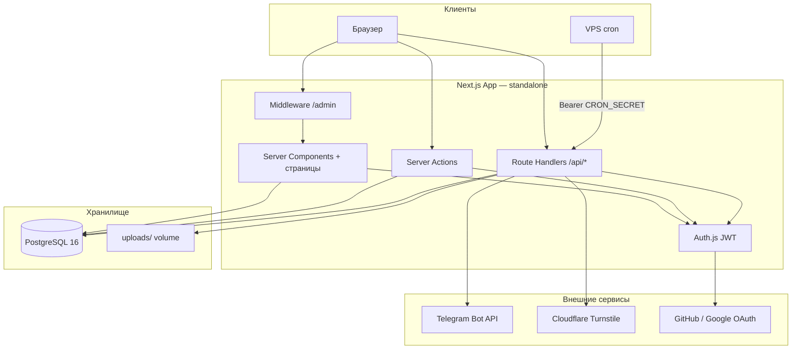
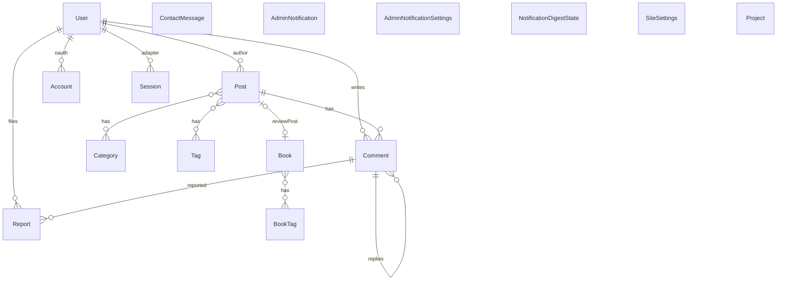
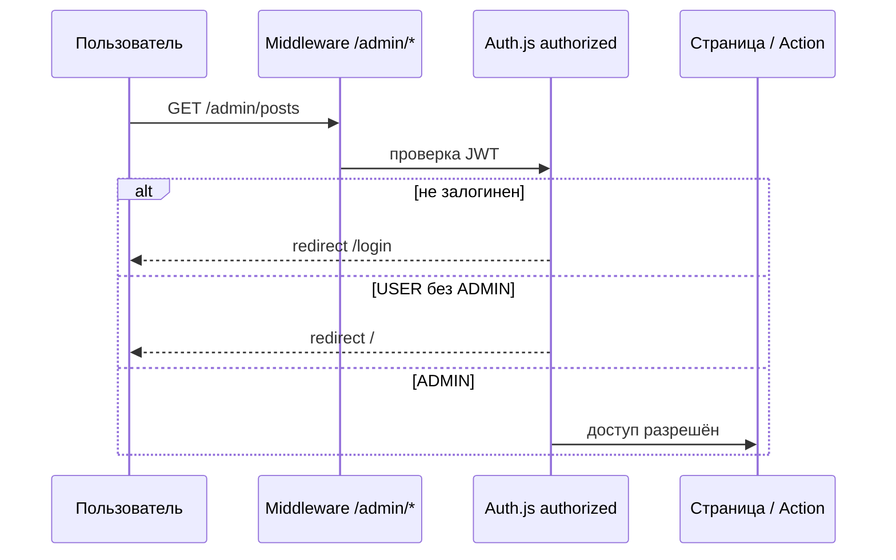
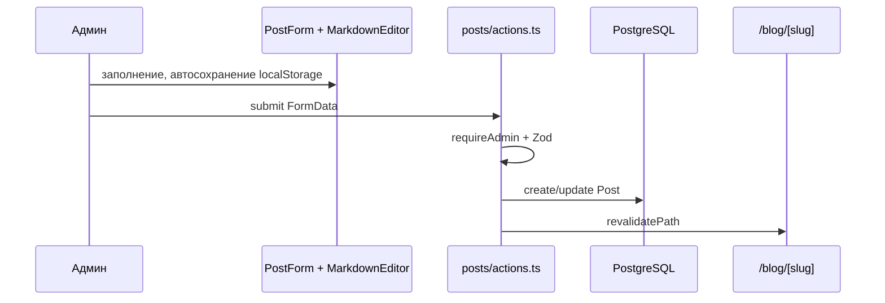

# Архитектура catshredias-blog

Документ описывает устройство проекта [catshredia.ru](https://catshredia.ru): персональный сайт-визитка с блогом, портфолио, библиотекой книг и админ-панелью.

**Связанные материалы:** [README](../README.md) (быстрый старт), [deploy-vps.md](./deploy-vps.md) (деплой), `_docs/` (техническое задание).

---

## 1. Обзор

### 1.1 Назначение

Монолитное веб-приложение на Next.js, которое объединяет:

- **публичный сайт** — контент, комментарии, профиль пользователя;
- **админ-панель** — CRUD контента, модерация, настройки сайта и уведомлений;
- **фоновые задачи** — публикация отложенных постов и дайджесты комментариев (cron по HTTP).

### 1.2 Архитектурный стиль

| Принцип | Реализация |
|---------|------------|
| Монолит | Один репозиторий, один процесс Node.js (standalone Next.js) |
| Full-stack React | Server Components + Client Components в одном App Router |
| Colocation | Server Actions рядом с админ-страницами (`actions.ts`) |
| Слой запросов | Prisma-логика в `src/lib/queries/`, не в компонентах страниц |
| Валидация на границе | Zod в `src/lib/validations/` для FormData и JSON |

### 1.3 Высокоуровневая схема



---

## 2. Технологический стек

| Слой | Технология | Версия (ориентир) |
|------|------------|-------------------|
| Runtime | Node.js | 22+ |
| Framework | Next.js App Router | 16.x |
| UI | React | 19.x |
| Язык | TypeScript | 5.x |
| Стили | Tailwind CSS | v4 |
| ORM | Prisma | 6.x |
| БД | PostgreSQL | 16 |
| Auth | Auth.js (NextAuth v5 beta) | JWT-сессии |
| Формы | react-hook-form, Zod | — |
| Markdown (рендер) | react-markdown, remark/rehype | GFM, wiki-links, alerts |
| Markdown (редактор) | CodeMirror 6 | `@uiw/react-codemirror` |
| Тесты | Vitest | unit |
| Линт | ESLint + eslint-config-next | — |
| Контейнеризация | Docker multi-stage, `output: "standalone"` | — |
| Reverse proxy | Nginx на VPS | примеры в `docs/nginx/` |

---

## 3. Структура репозитория

```text
catshredias-blog/
├── prisma/
│   ├── schema.prisma      # Модели и enum
│   ├── migrations/        # SQL-миграции
│   └── seed.ts            # Начальные данные (админ, мок-контент)
├── src/
│   ├── app/               # App Router: layouts, pages, API, actions
│   │   ├── (public)/      # Публичный layout (header + footer)
│   │   ├── (admin)/       # Layout админки
│   │   ├── api/           # Route Handlers
│   │   ├── actions/       # Глобальные Server Actions (регистрация)
│   │   ├── layout.tsx     # Root: тема, сессия, JSON-LD
│   │   ├── sitemap.ts, robots.ts
│   ├── components/        # UI по доменам
│   │   ├── admin/         # Формы, markdown-editor, таблицы
│   │   ├── blog/          # Лента, статья, комментарии, треки
│   │   ├── portfolio/, library/, contacts/, auth/, layout/, markdown/, ui/
│   ├── lib/               # Бизнес-логика
│   │   ├── queries/       # Prisma-запросы по сущностям
│   │   ├── validations/   # Zod-схемы
│   │   ├── notifications/ # Telegram, digest, AdminNotification
│   │   └── *.ts           # auth, uploads, slug, markdown-*, rate-limit…
│   ├── data/mock/         # Данные для seed
│   ├── types/             # Расширения next-auth (role в session)
│   └── middleware.ts      # Экспорт auth middleware для /admin/*
├── uploads/               # Файлы пользователя (volume в Docker, не в git)
├── docs/                  # Деплой, Nginx, этот документ
├── scripts/               # backup-db, sync-from-vps
├── .github/workflows/     # CI
├── Dockerfile
└── docker-compose.yml
```

**Алиас импортов:** `@/*` → `src/*`.

---

## 4. Маршрутизация и layouts

### 4.1 Route groups

Next.js использует группы маршрутов без влияния на URL:

| Группа | Физический путь | URL | Layout |
|--------|-----------------|-----|--------|
| `(public)` | `src/app/(public)/…` | `/`, `/blog`, … | `SiteHeader` + `SiteFooter` |
| `(admin)` | `src/app/(admin)/admin/…` | `/admin/…` | Минимальный header + `AdminNav` |

### 4.2 Публичные маршруты

| URL | Назначение |
|-----|------------|
| `/` | Главная: hero, био, статус «Ищу работу» |
| `/blog`, `/blog/[slug]` | Лента и статья |
| `/portfolio`, `/portfolio/[slug]` | Проекты |
| `/library`, `/library/[slug]` | Книги |
| `/contacts` | Обратная связь |
| `/login`, `/register`, `/profile` | Аутентификация и профиль |
| `/privacy`, `/personal-data-consent` | Юридические страницы |

### 4.3 Админ-маршруты

| URL | Назначение |
|-----|------------|
| `/admin` | Дашборд |
| `/admin/login` | Вход только для `ADMIN` |
| `/admin/posts`, `…/new`, `…/[id]/edit` | Посты |
| `/admin/projects`, `…` | Портфолио-проекты |
| `/admin/books`, `…` | Библиотека |
| `/admin/categories`, `/admin/tags` | Таксономия блога |
| `/admin/portfolio-settings` | hh.ru, PDF-резюме, «Ищу работу» |
| `/admin/comments`, `/admin/reports` | Модерация |
| `/admin/notifications` | Лента и настройки уведомлений |
| `/admin/formatting` | Справка по Markdown |

### 4.4 SEO

- `src/app/sitemap.ts` — динамический sitemap (посты, проекты, книги + статика).
- `src/app/robots.ts` — robots.txt.
- JSON-LD (`personJsonLd`, `websiteJsonLd`, `articleJsonLd`) в layout и страницах статей.

---

## 5. Слой данных

### 5.1 Доступ к БД

- Singleton `prisma` (`src/lib/prisma.ts`) с защитой от множественных инстансов в dev.
- Обязательные env валидируются при старте (`src/lib/env.ts`): `DATABASE_URL`, `AUTH_SECRET`, `NEXT_PUBLIC_SITE_URL`.
- Все чтения/записи для страниц — через `src/lib/queries/*`.

### 5.2 Модель данных (упрощённо)



### 5.3 Ключевые enum

| Enum | Значения | Где используется |
|------|----------|------------------|
| `Role` | ADMIN, USER | Доступ в админку |
| `PostStatus` | DRAFT, PUBLISHED, SCHEDULED | Посты, cron публикации |
| `PostTrackType` | NONE, UPLOAD, YANDEX_MUSIC, YOUTUBE_MUSIC | Музыкальный блок в посте |
| `CommentStatus` | PENDING, APPROVED, REJECTED | Комментарии (по умолчанию APPROVED) |
| `BookStatus` | PLANNED, READING, READ | Библиотека |
| `ReportStatus` | PENDING, REVIEWED, DISMISSED | Жалобы |
| `NotifyMode` | INSTANT, DAILY, WEEKLY, OFF | Настройки уведомлений |

### 5.4 Singleton-настройки

| Модель | id | Назначение |
|--------|-----|------------|
| `SiteSettings` | `"site"` | hh.ru, PDF-резюме, флаг «Ищу работу» |
| `AdminNotificationSettings` | `"default"` | Режимы уведомлений, Telegram |
| `NotificationDigestState` | `"default"` | Метки последних дайджестов |

### 5.5 Миграции

Миграции в `prisma/migrations/`. На продакшене — только `prisma migrate deploy` (через Docker profile `migrate`), не `db push`.

---

## 6. Аутентификация и авторизация

### 6.1 Провайдеры

1. **Credentials** (email + password, bcrypt) — всегда включён.
2. **GitHub OAuth** — если заданы `AUTH_GITHUB_ID` и `AUTH_GITHUB_SECRET`.
3. **Google OAuth** — если заданы `AUTH_GOOGLE_ID` и `AUTH_GOOGLE_SECRET`.

OAuth-пользователи при создании получают `Role.USER` (event `createUser`).

### 6.2 Сессия

- Стратегия: **JWT** (не database sessions, хотя `PrismaAdapter` подключён для Account/User).
- В JWT и session попадают: `id`, `role`, `name`, `image`.
- Типы расширены в `src/types/next-auth.d.ts`.

### 6.3 Защита маршрутов



**Middleware** (`src/middleware.ts`): matcher только `/admin/:path*`, делегирует в `auth` callback `authorized`:

- `/admin/*` (кроме `/admin/login`): нужен login + `Role.ADMIN`.
- `/admin/login`: редирект на `/admin`, если уже admin.

**Server Actions:** `requireAdmin()` в начале каждого action.

**Публичный `/login`:** вход без проверки роли. **Админ `/admin/login`:** после `signIn` проверяется `isAdminRole`, иначе `signOut`.

### 6.4 Регистрация и удаление

- `registerUser` (Server Action): Zod, rate limit 3/час, bcrypt hash(12).
- Удаление аккаунта: soft delete (`deletedAt`); `authorize` блокирует таких пользователей.

### 6.5 Замечание по API

`/api/admin/upload` и `/api/admin/link-targets` проверяют наличие сессии, но **не роль ADMIN**. Middleware не покрывает `/api/*`. Для усиления безопасности стоит добавить `requireAdmin` или аналог в этих handlers.

---

## 7. API и Server Actions

### 7.1 Route Handlers

| Метод | Путь | Назначение | Доступ |
|-------|------|------------|--------|
| GET/POST | `/api/auth/[...nextauth]` | Auth.js | Публичный |
| GET | `/api/posts` | Cursor pagination, поиск, фильтры | Публичный |
| GET | `/api/projects` | Список проектов | Публичный |
| POST | `/api/comments` | Новый комментарий | Auth + Turnstile + rate limit |
| POST | `/api/comments/[id]/report` | Жалоба | Auth |
| POST | `/api/contacts` | Обратная связь | Rate limit по IP/email |
| POST/PATCH/DELETE | `/api/user/*` | Аватар, профиль, удаление | Auth |
| POST | `/api/admin/upload` | Загрузка файлов | Session |
| GET | `/api/admin/link-targets` | Autocomplete wiki-links | Session |
| GET | `/api/uploads/[...path]` | Раздача файлов (Range для audio) | Публичный |
| POST | `/api/cron/publish-scheduled` | Публикация SCHEDULED | Bearer `CRON_SECRET` |
| POST | `/api/cron/notify-digest` | Дайджест комментариев | Bearer `CRON_SECRET` |
| GET | `/api/health` | Health + `SELECT 1` | Публичный |

### 7.2 Паттерн API handler

1. Parse body/query (Zod).
2. Auth / rate limit / Turnstile при необходимости.
3. Вызов `lib/queries` или Prisma.
4. `NextResponse.json` + логирование (`src/lib/logger.ts`).
5. Уведомления — fire-and-forget: `void notifyX().catch(...)`.

### 7.3 Server Actions (админка)

Расположены в `src/app/(admin)/admin/*/actions.ts` и `src/app/actions/auth.ts`.

Типичный поток:

1. `requireAdmin()`.
2. Парсинг `FormData` через Zod (`lib/validations/`).
3. Запись в БД.
4. `revalidatePath` для затронутых страниц.
5. `redirect` после успешного create.

Формы используют `useActionState` и отображают `fieldErrors`.

---

## 8. Markdown

### 8.1 Рендер (публичный сайт и превью)

Компонент `MarkdownContent`:

| Возможность | Реализация |
|-------------|------------|
| GFM | `remark-gfm` |
| Wiki-links | `remark-wiki-link` + кастомный `createRemarkWikiLink` |
| Теги `#tag` | `remarkTags` |
| GitHub alerts | `remark-github-blockquote-alert` |
| Спойлеры | `splitMarkdownSpoilers` + кастомный рендер |
| Подсветка кода | `rehype-highlight` |
| Якоря заголовков | `rehype-slug` |

### 8.2 Редактор (админка)

`MarkdownEditor` + `MarkdownCodemirror`:

- CodeMirror 6: подсветка, fold заголовков, wiki-link autocomplete.
- Режимы: Source / Split / Preview (`react-resizable-panels`).
- Автосохранение черновика в `localStorage` (`editor-draft.ts`, `post-form-draft.ts`).
- Поиск и замена (`@codemirror/search`, Ctrl+F / Ctrl+H).
- Загрузка изображений/PDF через `/api/admin/upload`, drag-and-drop и paste.
- TOC: `MarkdownFloatingToc` с `placement="sticky-top"`, по умолчанию свёрнут.

### 8.3 Кастомные модули

| Файл | Назначение |
|------|------------|
| `markdown-wikilink.ts` | Цели ссылок, remark-плагин |
| `markdown-tags.ts` | Хештеги в тексте |
| `markdown-spoiler.ts` | Блоки `:::spoiler` |
| `markdown-callout.ts` | Сниппеты callout |
| `markdown-table.ts` | Сниппет таблицы GFM |
| `markdown-headings.ts` | Извлечение заголовков для TOC |

---

## 9. Загрузки файлов

- Сохранение: `src/lib/uploads.ts` → каталог `UPLOAD_DIR` (по умолчанию `./uploads`).
- Лимиты: изображения/PDF до 5 МБ, аудио до 50 МБ.
- URL: `/api/uploads/{filename}`.
- Route handler поддерживает **Range** для стриминга аудио (треки в постах).
- Защита от path traversal: `path.basename`.
- В Docker — volume `uploads` для персистентности.

---

## 10. Уведомления администратора

```mermaid
flowchart LR
  subgraph events [События]
    Contact[Форма контактов]
    Report[Жалоба на комментарий]
    Comment[Новый комментарий]
  end

  subgraph pipeline [Обработка]
    Create[create.ts — AdminNotification в БД]
    Settings[settings.ts — NotifyMode]
    TG[telegram.ts]
    Digest[digest.ts — cron]
  end

  Contact --> Create
  Report --> Create
  Comment --> Create
  Create --> Settings
  Settings -->|INSTANT| TG
  Digest -->|DAILY/WEEKLY| TG
  Create --> UI[/admin/notifications]
```

- **Instant:** контакт, жалоба, комментарий (по настройке).
- **Digest:** cron `POST /api/cron/notify-digest?period=daily|weekly`.
- Telegram опционален; при блокировке VPS — `TELEGRAM_PROXY_URL` / `HTTPS_PROXY`.
- UI: `/admin/notifications` — лента + настройки режимов.

---

## 11. Комментарии

- Только для авторизованных пользователей.
- Публикуются сразу (`CommentStatus.APPROVED` по умолчанию).
- Дерево ответов: `comments-tree.ts`, ограничение глубины вложенности.
- Cloudflare Turnstile — включается только при наличии **обоих** ключей.
- Rate limit in-memory (`src/lib/rate-limit.ts`).
- Удалённые пользователи: `deleted-user.ts` подменяет отображаемое имя.

---

## 12. Безопасность

| Мера | Где |
|------|-----|
| Security headers | `next.config.ts` (X-Frame-Options, nosniff, Permissions-Policy) |
| JWT + role check | Middleware `/admin/*`, `requireAdmin()` |
| bcrypt (cost 12) | Пароли пользователей |
| Rate limiting | Регистрация, контакты, комментарии (in-memory, single-instance) |
| Turnstile | Комментарии (опционально) |
| Cron Bearer | `CRON_SECRET` |
| Soft delete | Пользователи (`deletedAt`) |
| Env validation | `src/lib/env.ts` |

**Ограничения single-instance:** in-memory rate limit не масштабируется на несколько реплик без Redis/общего хранилища.

---

## 13. Тестирование и CI

### 13.1 Unit-тесты (Vitest)

Покрывают чистую логику без браузера:

- slug, post-slug, markdown-плагины, comments-tree;
- rate-limit, validations, notifications (format, telegram-fetch).

Конфиг: `vitest.config.ts`, паттерн `src/**/*.test.ts`.

### 13.2 CI (`.github/workflows/ci.yml`)

Триггер: push/PR в `main`.

1. PostgreSQL 16 service container.
2. Node 22, `npm ci`.
3. `npm run lint`.
4. `npm run test`.
5. `prisma migrate deploy` + `npm run db:seed`.
6. `npm run build`.

Деплой на VPS — вне CI, вручную по [deploy-vps.md](./deploy-vps.md).

---

## 14. Деплой и инфраструктура

### 14.1 Docker

- **Multi-stage:** deps → builder (`prisma generate` + `next build`) → runner (standalone).
- Пользователь `nextjs` (non-root).
- Сервисы compose: `web`, `db`, profiles `migrate`, `seed`.
- Локальный Postgres: порт **55433**, БД `portfolio_db`.

### 14.2 Продакшен (VPS)

- Nginx → контейнер Next.js.
- SSL (Let's Encrypt).
- Cron на хосте: `publish-scheduled`, `notify-digest` с заголовком `Authorization: Bearer $CRON_SECRET`.
- Бэкапы: `scripts/backup-db.sh` / `backup-db.ps1`.

### 14.3 Переменные окружения

| Переменная | Обязательно | Назначение |
|------------|-------------|------------|
| `DATABASE_URL` | да | PostgreSQL |
| `AUTH_SECRET` | да | Секрет Auth.js (≥ 32 символов) |
| `AUTH_URL` | да | Базовый URL приложения |
| `NEXT_PUBLIC_SITE_URL` | да | Публичный URL (SEO, ссылки на uploads) |
| `ADMIN_EMAIL`, `ADMIN_PASSWORD` | для seed | Учётка администратора |
| `AUTH_GITHUB_*`, `AUTH_GOOGLE_*` | нет | OAuth |
| `NEXT_PUBLIC_TURNSTILE_*`, `TURNSTILE_SECRET_KEY` | нет | Капча (оба ключа) |
| `CRON_SECRET` | нет | Защита cron endpoints |
| `TELEGRAM_BOT_TOKEN`, `TELEGRAM_CHAT_ID` | нет | Telegram |
| `TELEGRAM_PROXY_URL` / `HTTPS_PROXY` | нет | Прокси для Telegram API |
| `UPLOAD_DIR` | нет | Каталог загрузок |
| `NPM_REGISTRY` | нет | Mirror npm для сборки на VPS |

Полный список и примеры — в [README](../README.md) и `.env.example`.

---

## 15. Соглашения разработки

### 15.1 Код

- Strict TypeScript, alias `@/*`.
- Язык UI и сообщений об ошибках — **русский**.
- Логирование через `src/lib/logger.ts` (info/error).
- `serverExternalPackages: ["undici"]` — для Telegram через прокси.

### 15.2 UI

- Тема: `ThemeProvider` + CSS-переменные (`globals.css`), light/dark/system.
- Переиспользуемые примитивы: `src/components/ui/`.
- Блог: infinite scroll через client fetch `/api/posts` с cursor.

### 15.3 Данные для seed

`src/data/mock/` — только для `prisma/seed.ts`, не используется в runtime.

---

## 16. Потоки данных (типовые сценарии)

### 16.1 Публикация поста



### 16.2 Отложенная публикация

Cron → `POST /api/cron/publish-scheduled` → посты со `status=SCHEDULED` и `publishedAt <= now` → `PUBLISHED`.

### 16.3 Комментарий

Client → `POST /api/comments` → Turnstile + rate limit → insert Comment → `notifyComment` (instant/digest по настройкам).

---

## 17. Известные ограничения и точки роста

1. **Rate limit in-memory** — не подходит для горизонтального масштабирования без доработки.
2. **Admin API без проверки роли** — `/api/admin/*` доступен любому залогиненному USER.
3. **JWT без server-side revoke** — отзыв сессии только через истечение/смену секрета.
4. **Нет E2E-тестов** — только unit + CI build с Postgres.
5. **Один VPS** — архитектура рассчитана на single-instance deployment.

---

## 18. Карта зависимостей модулей (lib)

```text
pages / components
    ↓
lib/queries/*     lib/validations/*
    ↓                    ↓
lib/prisma.ts ←──────────┘
    ↓
PostgreSQL

lib/notifications/* → lib/queries, telegram-fetch, prisma
lib/uploads.ts      → fs, env
lib/auth.ts         → prisma, auth-helpers
lib/markdown-*      → unified/remark (без БД)
```

---

*Документ актуален для структуры репозитория catshredias-blog. При изменении схемы БД, маршрутов или деплоя обновляйте соответствующие разделы.*
